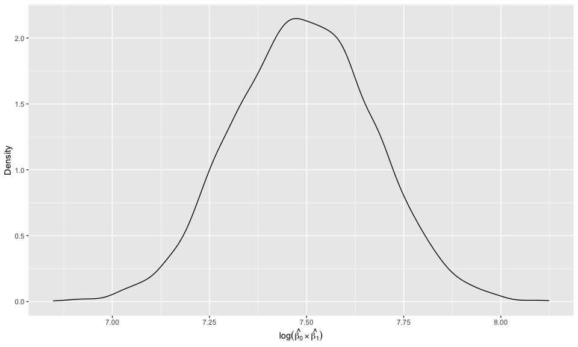

Homework 6
================
Pooja Mukund
11/26/2021

``` r
#Load relevant libraries

library(tidyverse)
```

    ## ── Attaching packages ─────────────────────────────────────── tidyverse 1.3.1 ──

    ## ✓ ggplot2 3.3.5     ✓ purrr   0.3.4
    ## ✓ tibble  3.1.5     ✓ dplyr   1.0.7
    ## ✓ tidyr   1.1.3     ✓ stringr 1.4.0
    ## ✓ readr   2.0.1     ✓ forcats 0.5.1

    ## ── Conflicts ────────────────────────────────────────── tidyverse_conflicts() ──
    ## x dplyr::filter() masks stats::filter()
    ## x dplyr::lag()    masks stats::lag()

``` r
library(viridis)
```

    ## Loading required package: viridisLite

``` r
library(modelr)
library(mgcv)
```

    ## Loading required package: nlme

    ## 
    ## Attaching package: 'nlme'

    ## The following object is masked from 'package:dplyr':
    ## 
    ##     collapse

    ## This is mgcv 1.8-38. For overview type 'help("mgcv-package")'.

``` r
#Setup for visualizations
knitr::opts_chunk$set(
  fig.width = 10,
  fig.asp = .6,
  out.width = "90%"
)
```

## Load Data

``` r
birth<- read_csv("data/birthweight.csv")
```

    ## Rows: 4342 Columns: 20

    ## ── Column specification ────────────────────────────────────────────────────────
    ## Delimiter: ","
    ## dbl (20): babysex, bhead, blength, bwt, delwt, fincome, frace, gaweeks, malf...

    ## 
    ## ℹ Use `spec()` to retrieve the full column specification for this data.
    ## ℹ Specify the column types or set `show_col_types = FALSE` to quiet this message.

## Data Cleaning

First we will check if there are any NAs in columns

``` r
# Check for NAs 
birth%>%
summarise_all(funs(sum(is.na(.)))) # No NAs in columns 
```

    ## # A tibble: 1 × 20
    ##   babysex bhead blength   bwt delwt fincome frace gaweeks malform menarche
    ##     <int> <int>   <int> <int> <int>   <int> <int>   <int>   <int>    <int>
    ## 1       0     0       0     0     0       0     0       0       0        0
    ## # … with 10 more variables: mheight <int>, momage <int>, mrace <int>,
    ## #   parity <int>, pnumlbw <int>, pnumsga <int>, ppbmi <int>, ppwt <int>,
    ## #   smoken <int>, wtgain <int>

From the data description in homework assignment we know that `babysex`,
`frace`, `malform`, `mrace` are all categorical variables that are
currently coded numerically. We will first change this to categorical
variables.

``` r
birth%>%
  summarise_all(class)
```

    ## # A tibble: 1 × 20
    ##   babysex bhead   blength bwt     delwt   fincome frace gaweeks malform menarche
    ##   <chr>   <chr>   <chr>   <chr>   <chr>   <chr>   <chr> <chr>   <chr>   <chr>   
    ## 1 numeric numeric numeric numeric numeric numeric nume… numeric numeric numeric 
    ## # … with 10 more variables: mheight <chr>, momage <chr>, mrace <chr>,
    ## #   parity <chr>, pnumlbw <chr>, pnumsga <chr>, ppbmi <chr>, ppwt <chr>,
    ## #   smoken <chr>, wtgain <chr>

``` r
#All coded numerically 

birth%>%
  distinct(frace)
```

    ## # A tibble: 5 × 1
    ##   frace
    ##   <dbl>
    ## 1     1
    ## 2     2
    ## 3     3
    ## 4     4
    ## 5     8

``` r
#Only 5 categories - 1, 2, 3, 4, 8 even though description has 9 there are no 9s that exist in this current dataset 

birth%>%
  distinct(mrace)
```

    ## # A tibble: 4 × 1
    ##   mrace
    ##   <dbl>
    ## 1     1
    ## 2     2
    ## 3     3
    ## 4     4

``` r
#Only 1, 2, 3, 4 for mrace

birth%>%
  distinct(malform)
```

    ## # A tibble: 2 × 1
    ##   malform
    ##     <dbl>
    ## 1       0
    ## 2       1

``` r
birth_cln<-birth%>%
  mutate( babysex = replace(babysex, babysex == 1, "Male"),
          babysex = replace(babysex, babysex == 2, "Female"), 
          frace = replace(frace, frace ==1, "White"),
          frace = replace(frace, frace ==2, "Black"),
          frace = replace(frace, frace ==3, "Asian"),
          frace = replace(frace, frace ==4, "Puerto Rican"),
          frace = replace(frace, frace ==8, "Other"),
          malform = as.logical(malform), 
          mrace = replace(mrace, mrace ==1, "White"),
          mrace = replace(mrace, mrace ==2, "Black"),
          mrace = replace(mrace, mrace ==3, "Asian"),
          mrace = replace(mrace, mrace ==4, "Puerto Rican"), 
          babysex = factor(babysex, levels=c("Male", "Female")), 
          frace = factor(frace, levels=c("White", "Black", "Asian", "Puerto Rican", "Other")),
          mrace = factor(mrace, levels=c("White", "Black", "Asian", "Puerto Rican")))

birth_cln%>%
  head(5)%>%
  knitr::kable()
```

| babysex | bhead | blength |  bwt | delwt | fincome | frace | gaweeks | malform | menarche | mheight | momage | mrace | parity | pnumlbw | pnumsga |    ppbmi | ppwt | smoken | wtgain |
|:--------|------:|--------:|-----:|------:|--------:|:------|--------:|:--------|---------:|--------:|-------:|:------|-------:|--------:|--------:|---------:|-----:|-------:|-------:|
| Female  |    34 |      51 | 3629 |   177 |      35 | White |    39.9 | FALSE   |       13 |      63 |     36 | White |      3 |       0 |       0 | 26.27184 |  148 |      0 |     29 |
| Male    |    34 |      48 | 3062 |   156 |      65 | Black |    25.9 | FALSE   |       14 |      65 |     25 | Black |      0 |       0 |       0 | 21.34485 |  128 |      0 |     28 |
| Female  |    36 |      50 | 3345 |   148 |      85 | White |    39.9 | FALSE   |       12 |      64 |     29 | White |      0 |       0 |       0 | 23.56517 |  137 |      1 |     11 |
| Male    |    34 |      52 | 3062 |   157 |      55 | White |    40.0 | FALSE   |       14 |      64 |     18 | White |      0 |       0 |       0 | 21.84508 |  127 |     10 |     30 |
| Female  |    34 |      52 | 3374 |   156 |       5 | White |    41.6 | FALSE   |       13 |      66 |     20 | White |      0 |       0 |       0 | 21.02642 |  130 |      1 |     26 |

Regression model for birthweight

From this [publication](https://pubmed.ncbi.nlm.nih.gov/7570074/), I
hypothesize that maternal race, infant sex, maternal smoking status, and
education would be important factors for birthweight. Since we do not
have education, I will use family monthly income (`fincome`) as a proxy
for education. The World Health Organization (WHO) defines smoking
status as “someone who smokes a tobacco product either daily or
occasionally”. I will use `smoken` and create a new variable
`smoke_status` defined by smoker as greater than 0 cigarettes per day
and non-smoker as 0 cigarettes per day.

``` r
#Create smoker variable 
birth_cln%>%
  distinct(smoken)
```

    ## # A tibble: 33 × 1
    ##    smoken
    ##     <dbl>
    ##  1  0    
    ##  2  1    
    ##  3 10    
    ##  4  4    
    ##  5  0.125
    ##  6 15    
    ##  7  8    
    ##  8  5    
    ##  9 20    
    ## 10  3    
    ## # … with 23 more rows

``` r
birth_cln<-birth_cln%>%
  mutate(smoke_status = case_when(smoken >0 ~ "smoker",
                                  smoken ==0 ~"non-smoker"))
```

Model Fitting Process - We will start with `smoke_status` and `babysex`
and evaluate based on Adjusted *R*<sup>2</sup>

``` r
fit = lm(bwt ~ smoke_status + babysex + gaweeks, data = birth_cln)
summary(fit)
```

    ## 
    ## Call:
    ## lm(formula = bwt ~ smoke_status + babysex + gaweeks, data = birth_cln)
    ## 
    ## Residuals:
    ##      Min       1Q   Median       3Q      Max 
    ## -1679.40  -285.90     0.44   299.96  1550.10 
    ## 
    ## Coefficients:
    ##                    Estimate Std. Error t value Pr(>|t|)    
    ## (Intercept)         559.373     87.989   6.357 2.26e-10 ***
    ## smoke_statussmoker -117.996     14.212  -8.303  < 2e-16 ***
    ## babysexFemale      -102.009     13.999  -7.287 3.75e-13 ***
    ## gaweeks              67.298      2.217  30.361  < 2e-16 ***
    ## ---
    ## Signif. codes:  0 '***' 0.001 '**' 0.01 '*' 0.05 '.' 0.1 ' ' 1
    ## 
    ## Residual standard error: 460.6 on 4338 degrees of freedom
    ## Multiple R-squared:  0.1918, Adjusted R-squared:  0.1912 
    ## F-statistic: 343.1 on 3 and 4338 DF,  p-value: < 2.2e-16

Let’s see if adding maternal race helps this model

``` r
fit_2 = lm(bwt ~ smoke_status + babysex + mrace + gaweeks, data = birth_cln)
summary(fit_2)
```

    ## 
    ## Call:
    ## lm(formula = bwt ~ smoke_status + babysex + mrace + gaweeks, 
    ##     data = birth_cln)
    ## 
    ## Residuals:
    ##      Min       1Q   Median       3Q      Max 
    ## -1650.94  -275.41    -0.01   280.79  1595.08 
    ## 
    ## Coefficients:
    ##                    Estimate Std. Error t value Pr(>|t|)    
    ## (Intercept)         976.891     88.071  11.092  < 2e-16 ***
    ## smoke_statussmoker -143.119     13.818 -10.357  < 2e-16 ***
    ## babysexFemale       -95.798     13.526  -7.082 1.65e-12 ***
    ## mraceBlack         -255.850     14.300 -17.891  < 2e-16 ***
    ## mraceAsian         -186.612     68.698  -2.716  0.00663 ** 
    ## mracePuerto Rican  -163.360     30.203  -5.409 6.69e-08 ***
    ## gaweeks              60.026      2.178  27.561  < 2e-16 ***
    ## ---
    ## Signif. codes:  0 '***' 0.001 '**' 0.01 '*' 0.05 '.' 0.1 ' ' 1
    ## 
    ## Residual standard error: 444.5 on 4335 degrees of freedom
    ## Multiple R-squared:  0.2477, Adjusted R-squared:  0.2467 
    ## F-statistic: 237.9 on 6 and 4335 DF,  p-value: < 2.2e-16

This slightly increased our Adjusted *R*<sup>2</sup> from 0.01957 to
0.1149. Let’s see if adding family monthly income helps (`fincome`).

``` r
fit_3 = lm(bwt ~ smoke_status + babysex + mrace+fincome +gaweeks, data = birth_cln)
summary(fit_3)
```

    ## 
    ## Call:
    ## lm(formula = bwt ~ smoke_status + babysex + mrace + fincome + 
    ##     gaweeks, data = birth_cln)
    ## 
    ## Residuals:
    ##      Min       1Q   Median       3Q      Max 
    ## -1646.46  -274.06     1.31   279.71  1598.13 
    ## 
    ## Coefficients:
    ##                     Estimate Std. Error t value Pr(>|t|)    
    ## (Intercept)         958.6837    88.9712  10.775  < 2e-16 ***
    ## smoke_statussmoker -142.2778    13.8287 -10.289  < 2e-16 ***
    ## babysexFemale       -95.5214    13.5259  -7.062 1.90e-12 ***
    ## mraceBlack         -247.3364    15.4825 -15.975  < 2e-16 ***
    ## mraceAsian         -182.0303    68.7638  -2.647  0.00815 ** 
    ## mracePuerto Rican  -155.7956    30.6566  -5.082 3.89e-07 ***
    ## fincome               0.4067     0.2837   1.434  0.15173    
    ## gaweeks              59.9135     2.1791  27.495  < 2e-16 ***
    ## ---
    ## Signif. codes:  0 '***' 0.001 '**' 0.01 '*' 0.05 '.' 0.1 ' ' 1
    ## 
    ## Residual standard error: 444.5 on 4334 degrees of freedom
    ## Multiple R-squared:  0.2481, Adjusted R-squared:  0.2469 
    ## F-statistic: 204.3 on 7 and 4334 DF,  p-value: < 2.2e-16

This slightly increased our Adjusted *R*<sup>2</sup> from 0.1149 to
0.1157. Still not the best model, this may suggest a linear model is not
the best fit for birthweight. However, we will continue using `fit_3`.

``` r
birth_cln %>% 
  modelr::add_residuals(fit_3) %>% 
  modelr::add_predictions(fit_3)%>%
  ggplot(aes(x = bwt, y = resid)) +geom_point()
```


``` r
birth_cln %>% 
  modelr::add_residuals(fit_3) %>% 
  modelr::add_predictions(fit_3)%>%
  ggplot(aes(x = pred, y = resid)) +
  geom_point()+ geom_hline(yintercept=0, linetype="dashed", color = "grey")+
  ylab("Prediction Value") + xlab("Residual Value") + ggtitle("Model Predictions against Residual Values")
```


The Residuals vs. Predicted Values plot is used to detect unequal
variance (heteroscedasticity) and outliers. We are looking to see that
residual values bounce around 0 and no unusual values stand out from the
pattern, which is an indication of no outliers. Based on the plot of
predictions against residual, the third model created looks like there
is a pretty good fit.

Compare your model to two others:

-   One using length at birth and gestational age as predictors (main
    effects only) - `model_comp_1`

-   One using head circumference, length, sex, and all interactions
    (including the three-way interaction) between these -
    `model_comp_2`.

``` r
model_comp_1 = lm(bwt ~ blength + gaweeks, data = birth_cln)
summary(model_comp_1)
```

    ## 
    ## Call:
    ## lm(formula = bwt ~ blength + gaweeks, data = birth_cln)
    ## 
    ## Residuals:
    ##     Min      1Q  Median      3Q     Max 
    ## -1709.6  -215.4   -11.4   208.2  4188.8 
    ## 
    ## Coefficients:
    ##              Estimate Std. Error t value Pr(>|t|)    
    ## (Intercept) -4347.667     97.958  -44.38   <2e-16 ***
    ## blength       128.556      1.990   64.60   <2e-16 ***
    ## gaweeks        27.047      1.718   15.74   <2e-16 ***
    ## ---
    ## Signif. codes:  0 '***' 0.001 '**' 0.01 '*' 0.05 '.' 0.1 ' ' 1
    ## 
    ## Residual standard error: 333.2 on 4339 degrees of freedom
    ## Multiple R-squared:  0.5769, Adjusted R-squared:  0.5767 
    ## F-statistic:  2958 on 2 and 4339 DF,  p-value: < 2.2e-16

``` r
model_comp_2 = lm(bwt ~ blength + bhead +babysex + bhead*blength*babysex, data = birth_cln)
summary(model_comp_2)
```

    ## 
    ## Call:
    ## lm(formula = bwt ~ blength + bhead + babysex + bhead * blength * 
    ##     babysex, data = birth_cln)
    ## 
    ## Residuals:
    ##      Min       1Q   Median       3Q      Max 
    ## -1132.99  -190.42   -10.33   178.63  2617.96 
    ## 
    ## Coefficients:
    ##                               Estimate Std. Error t value Pr(>|t|)    
    ## (Intercept)                 -7176.8170  1264.8397  -5.674 1.49e-08 ***
    ## blength                       102.1269    26.2118   3.896 9.92e-05 ***
    ## bhead                         181.7956    38.0542   4.777 1.84e-06 ***
    ## babysexFemale                6374.8684  1677.7669   3.800 0.000147 ***
    ## blength:bhead                  -0.5536     0.7802  -0.710 0.478012    
    ## bhead:babysexFemale          -198.3932    51.0917  -3.883 0.000105 ***
    ## blength:babysexFemale        -123.7729    35.1185  -3.524 0.000429 ***
    ## blength:bhead:babysexFemale     3.8781     1.0566   3.670 0.000245 ***
    ## ---
    ## Signif. codes:  0 '***' 0.001 '**' 0.01 '*' 0.05 '.' 0.1 ' ' 1
    ## 
    ## Residual standard error: 287.7 on 4334 degrees of freedom
    ## Multiple R-squared:  0.6849, Adjusted R-squared:  0.6844 
    ## F-statistic:  1346 on 7 and 4334 DF,  p-value: < 2.2e-16

Compare using cross-validation

``` r
cv_df =
  crossv_mc(birth_cln, 100) %>% 
  mutate(
    train = map(train, as_tibble),
    test = map(test, as_tibble))

cv_df = 
  cv_df %>% 
  mutate(
    model_1  = map(train, ~lm(bwt ~ smoke_status + babysex + mrace+fincome +gaweeks, data = .x)),
    model_2     = map(train, ~lm(bwt ~ blength + gaweeks, data = .x)),
    model_3  = map(train, ~lm(bwt ~ bhead*blength + bhead*blength*babysex + blength*babysex +bhead*babysex , data = .x))) %>% 
  mutate(
    rmse_1 = map2_dbl(model_1, test, ~rmse(model = .x, data = .y)),
    rmse_2    = map2_dbl(model_2, test, ~rmse(model = .x, data = .y)),
    rmse_3 = map2_dbl(model_3, test, ~rmse(model = .x, data = .y)))
```

``` r
cv_df %>% 
  select(starts_with("rmse")) %>% 
  pivot_longer(
    everything(),
    names_to = "model", 
    values_to = "rmse",
    names_prefix = "rmse_") %>% 
  mutate(model = fct_inorder(model)) %>% 
  ggplot(aes(x = model, y = rmse)) + geom_violin() + xlab("Model") + ylab("RMSE Score")
```


Model 3 seems to be the best fit and model 1 seems to be the worst fit.
The RMSE of Model 1 is the highest and RMSE of Model 3 is the lowest. It
is possible there are too many variables in model 1 and this is reducing
the predictability of the model. This suggests that head circumference,
length at birth, and baby sex are important variables for prediction of
birthweight. Model 2 had the least amount of predictors so it is
possible the model is too simple which would explain the lower RMSE.

## Problem 2

``` r
weather_df = 
  rnoaa::meteo_pull_monitors(
    c("USW00094728"),
    var = c("PRCP", "TMIN", "TMAX"), 
    date_min = "2017-01-01",
    date_max = "2017-12-31") %>%
  mutate(
    name = recode(id, USW00094728 = "CentralPark_NY"),
    tmin = tmin / 10,
    tmax = tmax / 10) %>%
  select(name, id, everything())
```

    ## Registered S3 method overwritten by 'hoardr':
    ##   method           from
    ##   print.cache_info httr

    ## using cached file: ~/Library/Caches/R/noaa_ghcnd/USW00094728.dly

    ## date created (size, mb): 2021-10-05 10:30:21 (7.602)

    ## file min/max dates: 1869-01-01 / 2021-10-31

``` r
weather_fit<-lm(tmax ~ tmin, data = weather_df)

log(weather_fit$coefficients[2]*weather_fit$coefficients[1])
```

    ##     tmin 
    ## 2.013752

``` r
lm(tmax ~ tmin, data = weather_df) %>% 
  broom::tidy() %>% 
  knitr::kable(digits = 3)
```

| term        | estimate | std.error | statistic | p.value |
|:------------|---------:|----------:|----------:|--------:|
| (Intercept) |    7.209 |     0.226 |    31.847 |       0 |
| tmin        |    1.039 |     0.017 |    61.161 |       0 |

``` r
broom::glance(weather_fit)%>%
  select(r.squared)
```

    ## # A tibble: 1 × 1
    ##   r.squared
    ##       <dbl>
    ## 1     0.912

``` r
boot_sample = function(df) {
  sample_frac(df, replace = TRUE)
}

boot_straps = 
  data_frame(
    strap_number = 1:5000,
    strap_sample = rerun(5000, boot_sample(weather_df))
  )

boot_straps
```

    ## # A tibble: 5,000 × 2
    ##    strap_number strap_sample      
    ##           <int> <list>            
    ##  1            1 <tibble [365 × 6]>
    ##  2            2 <tibble [365 × 6]>
    ##  3            3 <tibble [365 × 6]>
    ##  4            4 <tibble [365 × 6]>
    ##  5            5 <tibble [365 × 6]>
    ##  6            6 <tibble [365 × 6]>
    ##  7            7 <tibble [365 × 6]>
    ##  8            8 <tibble [365 × 6]>
    ##  9            9 <tibble [365 × 6]>
    ## 10           10 <tibble [365 × 6]>
    ## # … with 4,990 more rows

``` r
bootstrap_results = 
  boot_straps %>% 
  mutate(
    models = map(strap_sample, ~lm(tmax ~ tmin, data = .x) ),
    results = map(models, broom::tidy),
    summary = map(models, broom::glance))%>% 
  unnest(results)%>%
  select(term, estimate, summary)%>%
  unnest(summary)%>%
  select(term, estimate, r.squared)%>%
  pivot_wider(names_from = term,
              values_from = estimate)

bootstrap_results%>%
  mutate(log_b0_b1 = `(Intercept)` *tmin)%>%
  pivot_longer(cols = c("r.squared","log_b0_b1"),
               names_to = "quantity",
               values_to = "estimate")%>%
  select(quantity, estimate)%>%
  group_by(quantity) %>% 
  summarize(
    ci_lower = quantile(estimate, 0.025), 
    ci_upper = quantile(estimate, 0.975))%>%
  knitr::kable()
```

| quantity    | ci\_lower | ci\_upper |
|:------------|----------:|----------:|
| log\_b0\_b1 | 7.1399901 | 7.8371828 |
| r.squared   | 0.8945126 | 0.9268861 |

Let’s plot the distribution of the estimates. First look at the
distribution for *R*<sup>2</sup>.

``` r
#Density plot for R-Squared 
bootstrap_results%>%
  mutate(log_b0_b1 = `(Intercept)` *tmin)%>%
  ggplot(aes(x = r.squared)) + geom_density()+xlab(expression(R^2))+ylab("Density")
```


Now let’s look at the distribution plot for
*l**o**g*(*β̂*<sub>0</sub> \* *β̂*<sub>1</sub>)

``` r
bootstrap_results%>%
  mutate(log_b0_b1 = `(Intercept)` *tmin)%>%
  ggplot(aes(x = log_b0_b1)) + geom_density() +xlab(expression(log(hat(beta[0])%*%hat(beta[1]))))+ylab("Density")
```


